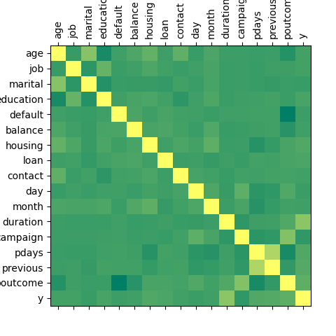

# Feature Engineering Techniques for Bank Problem of Kaggle Competitions

A number of techniques is applied to pre-process the given dataset:

1. Find and replace missing values.
2. Deal with categorical features.
3. Apply linear regression to predict NaN values of a certain feature.
4. Find correlations beween features and final output y_hat.
5. Apply PCA to highly correlated features to reduce dimensionality.
6. Detect Outliers with Boxplot diagram.

Correlation Map:

Detection of Outliers:

Removal of Outliers:
